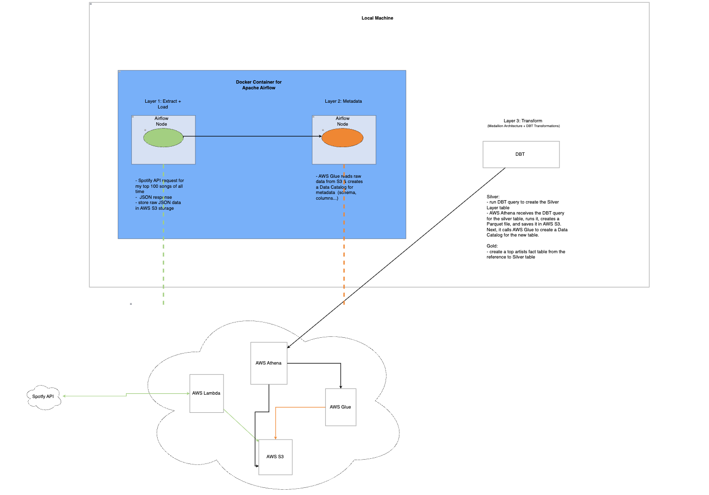

# Spotify ELT Data Pipeline

An automated data platform that extracts user listening history from the Spotify API, stages it in an AWS Data Lake, catalogs it automatically, and runs analytical transformations using dbt and Amazon Athena under a Medallion Architecture.

## Architecture & Key Value Decisions

### 1. Ingestion & Orchestration (Layer 1)
* **Tooling:** Apache Airflow running in local **Docker** containers. 
* **Execution:** Airflow safely triggers an **AWS Lambda** function across the cloud. Lambda pulls the top 100 tracks from the Spotify API and loads the raw data as JSON into an **Amazon S3** Bronze bucket.

### 2. Discovery & Metadata (Layer 2)
* **Tooling:** **AWS Glue Crawlers** & **Glue Data Catalog**.
* **Execution:** Airflow kicks off a Glue Crawler to scan the raw S3 JSON files, dynamically infer the nested schema types, and log the structural metadata into the Glue Catalog.

### 3. Transformation & Lineage (Layer 3)
* **Tooling:** **dbt Core** (Data Build Tool) + **Amazon Athena**.
* **Execution:** dbt compiles modular SQL models locally and issues them to Athena. Athena reads the Bronze S3 JSON, runs the queries entirely in its serverless memory, and writes the output back to S3 as optimized, columnar Parquet files.
  * **Silver Layer:** Flattens JSON arrays (`UNNEST`) and casts distinct column names (`stg_spotify_tracks`).
  * **Gold Layer:** Runs analytical aggregations to build business-ready fact tables (`fct_top_artists`).




---

## 🛠️ Tech Stack Cheat Sheet
* **Orchestration:** Apache Airflow (Dockerized)
* **Compute / Serverless:** AWS Lambda, Amazon Athena
* **Storage / Data Lake:** Amazon S3 (Bronze/Silver/Gold Parquet)
* **Data Catalog:** AWS Glue
* **Data Transformation:** dbt Core

---

## 🚀 Quick Setup & Run Manual

### 1. Clone & Configure
```bash
# Clone repository
git clone [https://github.com/aruukebay/Spotify-ELT-pipeline.git](https://github.com/aruukebay/Spotify-ELT-pipeline.git)
cd Spotify-ELT-pipeline

# Configure Environment Variables
cp .env.example .env
# Open .env and add your Spotify and AWS credentials


